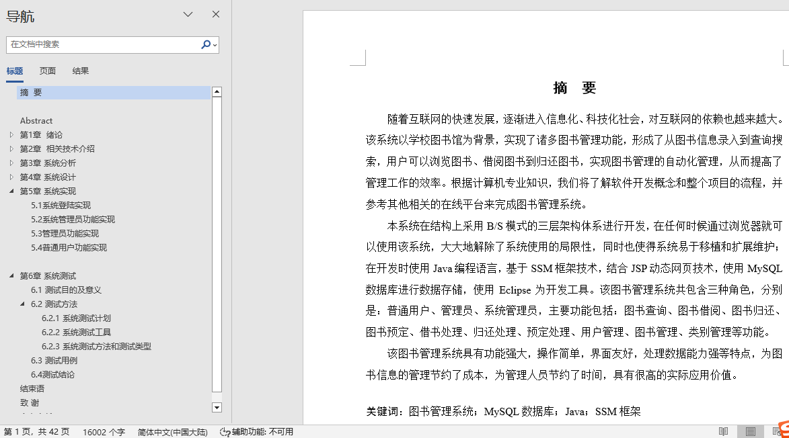
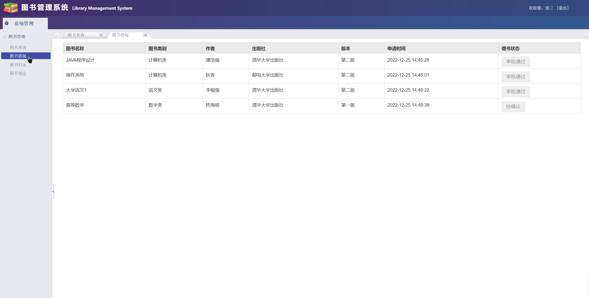
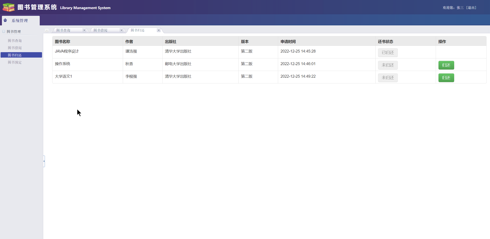
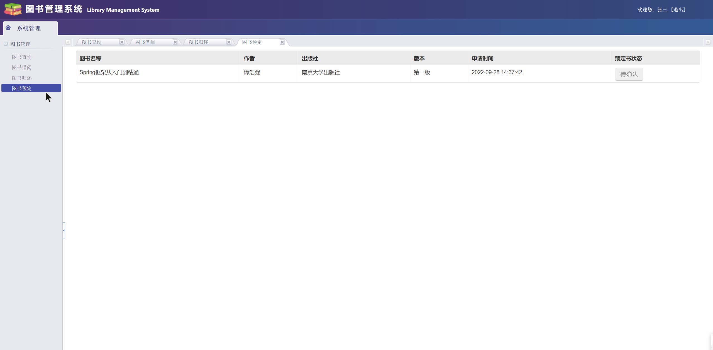
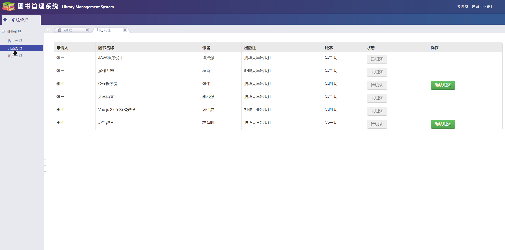
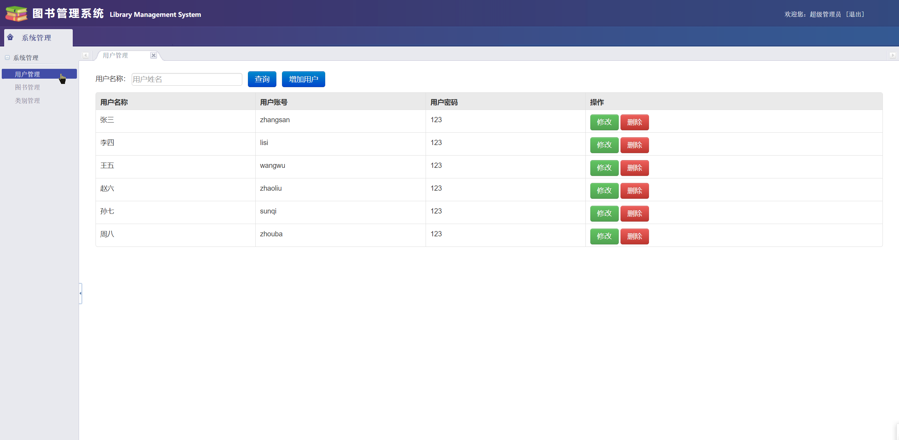
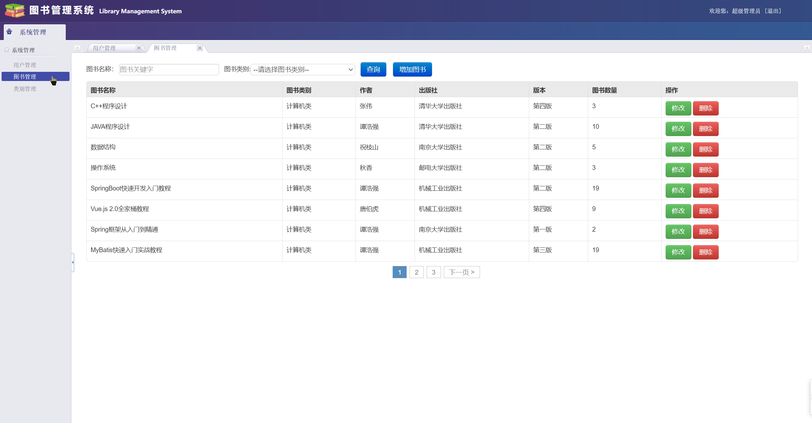
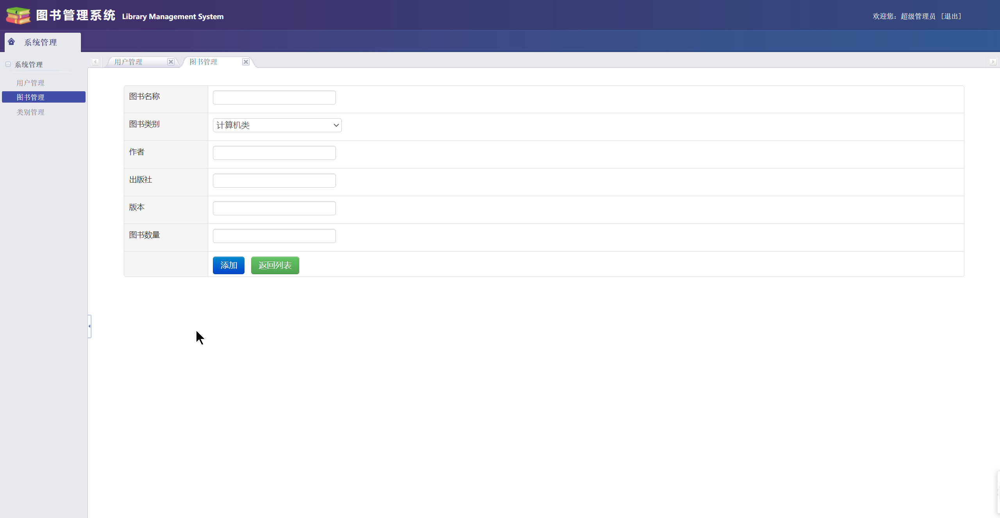

## 基于SSM实现的图书管理系统(程序+报告)

###  获取sql数据库文件: 从戎源码网 (https://armycodes.com/) QQ: 386869957 QQ群: 377586148
###  所有系统地址: (https://github.com/YuLin-Coder/AllProjectCatalog) 
###  所有项目以及源代码本人均调试运行无问题 可支持远程安装部署调试、定制修改、代码讲解

## 项目介绍
基于SSM实现的图书管理系统，系统共分为普通用户、管理员、超级管理员三个角色，主要功能如下
【普通用户】
书籍查询、书籍借阅、书籍归还、书籍预定
【管理员】
借书处理、归还处理、预定处理
【系统管理员】
用户管理、书籍管理、类别管理

## 项目技术
- 编程语言：Java
- 数据库：MySQL
- 前端技术：JSP、JavaScript、BootStrap、jQuery
- 后端技术：Spring、SpringMVC、MyBatis

## 运行环境
- JDK版本：JDK1.8及以上
- 开发工具：IDEA、Ecplise、Myecplise都可以
- 数据库: MySQL5.7及以上

## 运行截图

